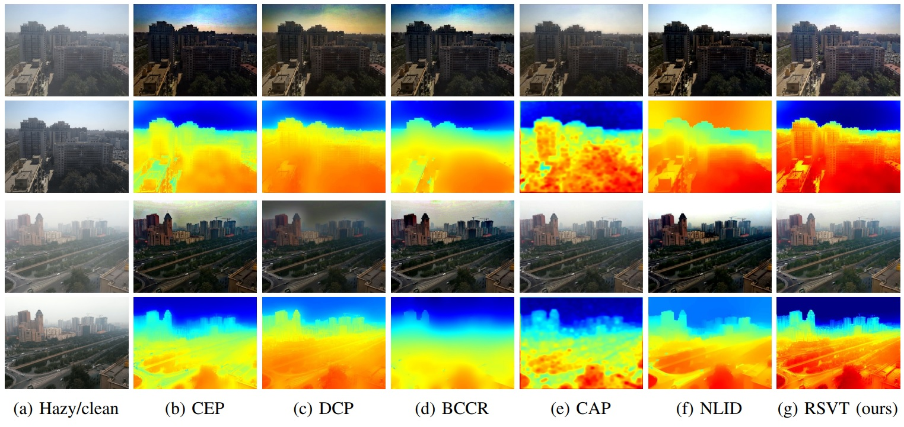
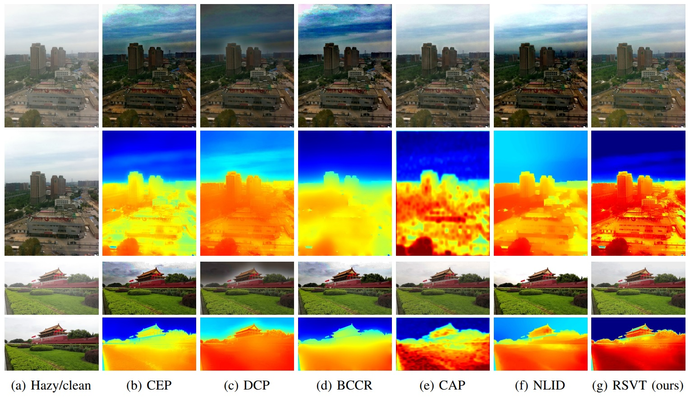
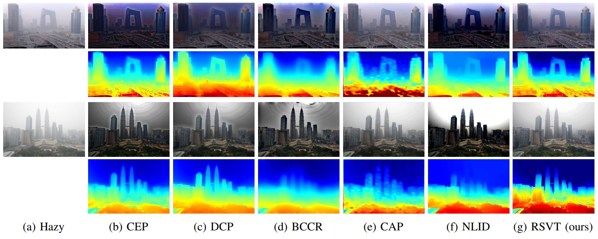
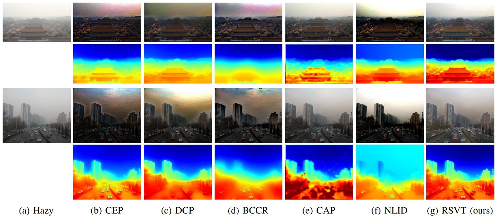

# Regional Saturation-Value Translation for Single Image Dehazing 

Official Python implementation of the Regional Saturation-Value Translation (RSVT) algorithm for single image haze removal.

<!---
Official Python implementation of the paper "Haze Removal via Regional Saturation-Value Translation and Soft Segmentation".
// Authors: [Le-Anh Tran](https://scholar.google.com/citations?user=WzcUE5YAAAAJ&hl=en) and [Dong-Chul Park](https://scholar.google.com/citations?user=VZUH4sUAAAAJ&hl=en)
--->

<p align="center">

</p>


## Introduction

<p align="justify"> 
 The proposed RSVT framework is developed based on two key insights derived from the HSV color space: first, the hue component shows negligible variation
 between corresponding hazy and haze-free points; and second, in the 2D saturation-value coordinate system, the majority of lines connecting hazy-clean point pairs tend to converge near the atmospheric light coordinates. Consequently, haze removal can be achieved through appropriate translations within the saturation-value coordinates.
</p>

<p align="center">

</p>

## Results

### 1. Quantitative Results

<p align="center">

</p>

<p align="center">

</p>

### 2. Qualitative Results

<p align="center">

</p>

<p align="center">

</p>

<p align="center">

</p>

<p align="center">

</p>

## Usage

1. Set input image path in [rsvt.py](https://github.com/tranleanh/rsvt/blob/main/rsvt.py#L128)

2. Open terminal and run:
```bashrc
$ python rsvt.py
```

## Citation

Please cite our works if you use the data in this repo. 

```bibtex
@article{tran2024single,
  title={Single Image Dehazing via Regional Saturation-Value Translation},
  author={Tran, Le-Anh and Kwon, Daehyun and Park, Dong-Chul},
  journal={Procedia Computer Science},
  volume={237},
  pages={517--524},
  year={2024},
  publisher={Elsevier}
}

@article{do2024drone,
  title={Drone-view Haze Removal via Regional Saturation-Value Translation and Soft Segmentation},
  author={Do, Truong-Dong and Tran, Le-Anh and Moon, Seokyong and Chung, Jio and Nguyen, Ngoc-Phi and Hong, Sung Kyung},
  journal={IEEE Access},
  year={2024},
  publisher={IEEE}
}
```

LA Tran
