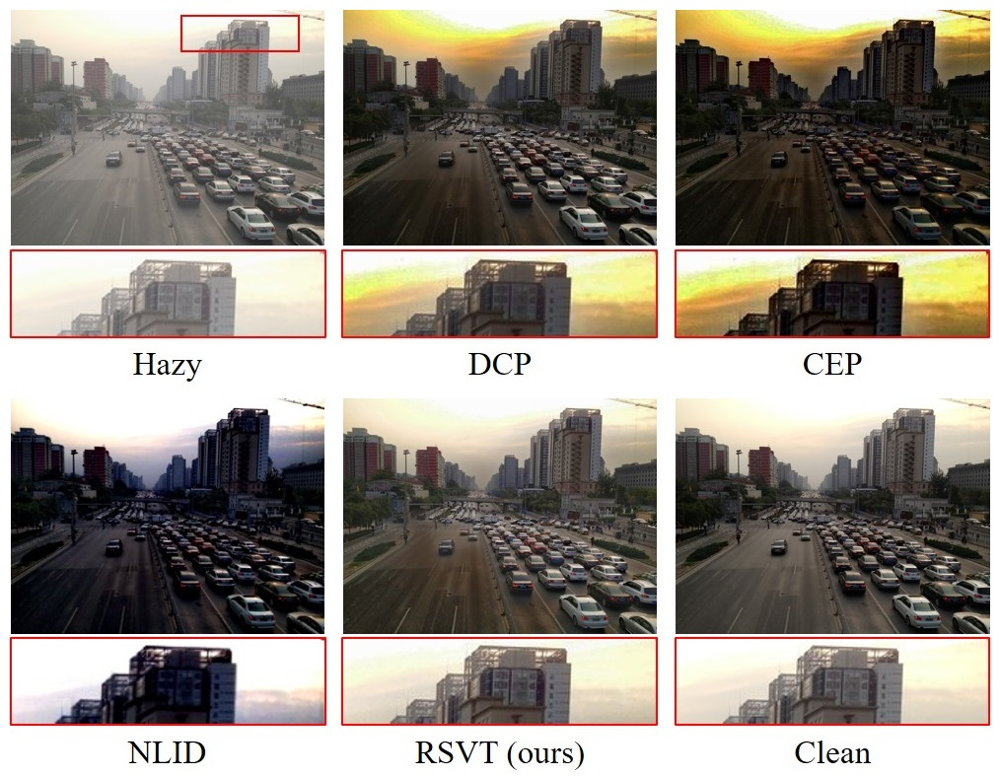
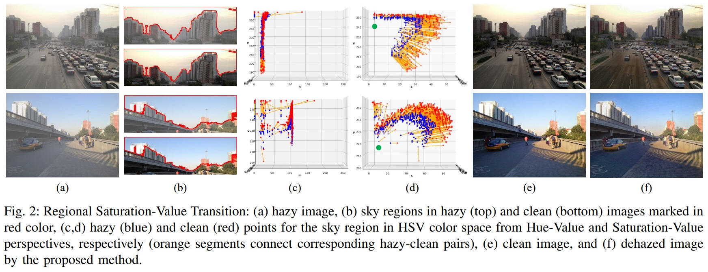
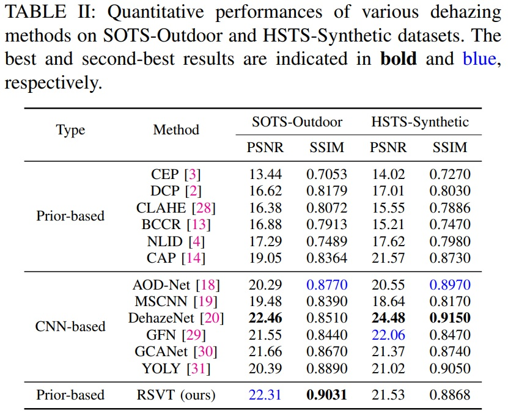
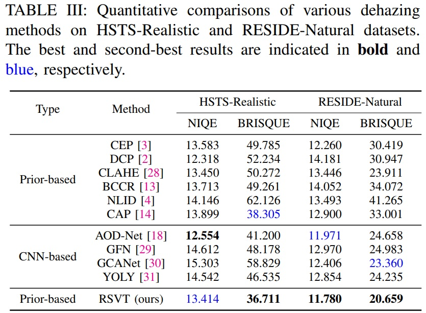

# Haze Removal via Regional Saturation-Value Translation and Soft Segmentation

This repo contains the official Python implementation of the paper "Haze Removal via Regional Saturation-Value Translation and Soft Segmentation".

Authors: [Le-Anh Tran](https://scholar.google.com/citations?user=WzcUE5YAAAAJ&hl=en) and [Dong-Chul Park](https://scholar.google.com/citations?user=VZUH4sUAAAAJ&hl=en)

<p align="center">

</p>


## Updates

- [x] Dehazing results
- [ ] Official code
- [ ] Paper


### Introduction

<p align="justify"> 
This paper proposes a single image dehazing prior, called Regional Saturation-Value Translation (RSVT), to tackle the color distortion problems caused by conventional dehazing approaches in bright regions. The RSVT prior is developed based on two key observations regarding the relationship between hazy and haze-free points in the HSV color space. First, the hue component shows marginal variation between corresponding hazy and haze-free points, consolidating a hypothesis that the pixel value variability induced by haze primarily occurs in the saturation and value spaces. Second, in the 2D saturation-value coordinate system, most lines passing through hazy-clean point pairs are likely to intersect near the atmospheric light coordinates. Accordingly, haze removal for the bright regions can be performed by properly translating saturation-value coordinates. In addition, an effective soft segmentation method based on a morphological min-max channel is introduced. By combining the soft segmentation mask with the RSVT prior, a comprehensive single image dehazing framework is devised. Experimental results on various synthetic and realistic hazy image datasets demonstrate that the proposed scheme successfully addresses color distortion issues and restores visually appealing images.
</p>

<p align="center">

</p>

### Results

#### 1. Quantitative Results:

<p align="center">

</p>

<p align="center">

</p>

#### 2. Qualitative Results:

(will be updated)

### Test

(will be updated)

### Citation

Please cite our works if you use the data in this repo. 

```
@inproceedings{tran2023single,
  title={Single image dehazing via regional saturation-value translation},
  author={Tran, Le-Anh and Kwon, Daehyun and Park, Dong-Chul},
  booktitle={International Conference on Industry Science and Computer Sciences Innovation},
  year={2023},
  organization={Elsevier}
}

@misc{tran2024rsvt,
  author = {Tran, Le-Anh and Park, Dong-Chul},
  title = {Haze Removal via Regional Saturation-Value Translation and Soft Segmentation},
  year = {2024},
  publisher = {GitHub},
  journal = {GitHub repository}
}
```

LA Tran
